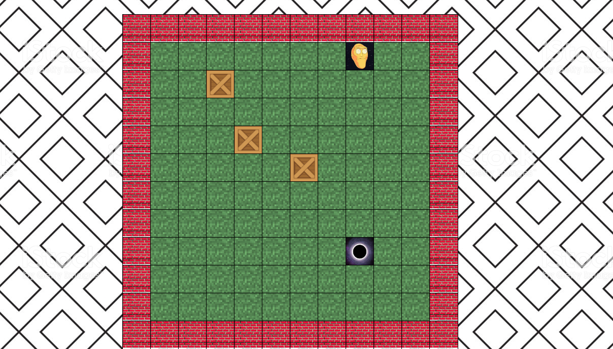

# WDI-PROJECT-ONE
Link to [my Github page](https://github.com/Gourgey)

## SOKOBAN V2
Sokoban (倉庫番 sōko-ban, "warehouse keeper") is a type of puzzle video game, in which the player pushes boxes or crates around in a warehouse, trying to get them to storage locations. Sokoban was created in 1981 by Hiroyuki Imabayashi - Wikipedia

This is my own version of Sokoban using virtually no initial HTML code and a small portion of CSS with a large focus on javascript.  It is a simple grid-based game using the arrow keys to move the character around the grass moving the crates into the black-hole.


The Game:


# Approach to Game:
Having spent the one week learning HTML and CSS and two weeks spent on Javascript, I thought it was appropriate to code the game from the base up using Javascript. I created a container div in HTML, then via Javascript created a function to append divs to the container (rows) and appended divs to those(columns)  in order to give me full control over the grid size - as seen below.

I then created a set of classes which were needed to produce my player, hole and crates.
Within each class I set functions to be run that would determine how each object behaved(i.e. stopping at borders and interacting with other objects). By use of classes I am able to recreate the objects needed and multiply and manipulate them however I like, giving me the ability to easily produce multiple levels if needed.


# Useful Code:

## Making and Invoking the Grid Function
```javascript
'The grid is made by javascript only with one'
function createGrid(x) {
  for (let rows = 0; rows < x; rows++) {
    for (let columns = 0; columns < x; columns++) {
      const myGrid = document.createElement('div');
      myGrid.classList.add('grid');
      myGrid.setAttribute('rowid', rows);
      myGrid.setAttribute('columnid', columns);
      myContainer.appendChild(myGrid);
    }
  }
}
  createGrid(12);
  ```
